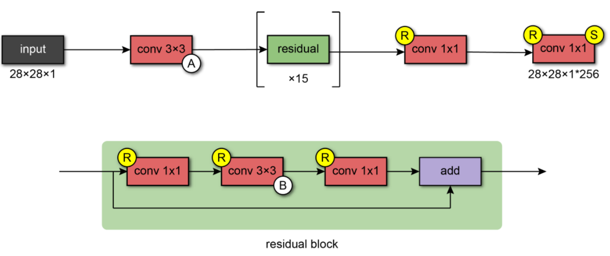
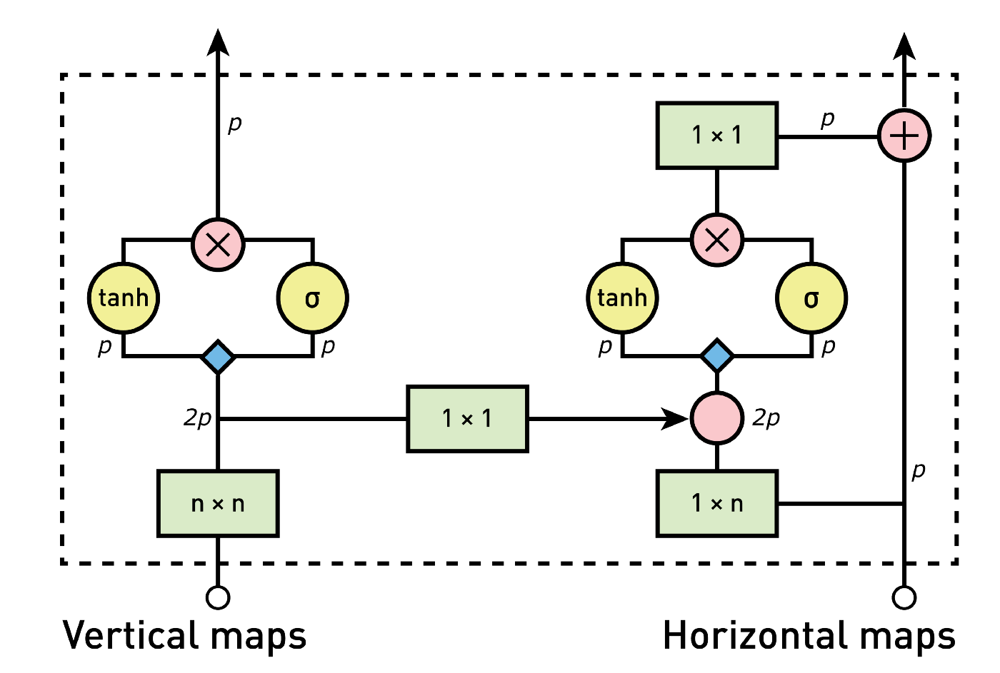
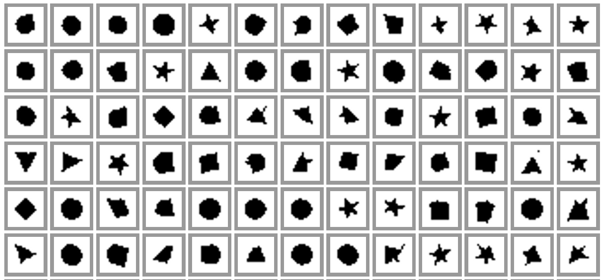
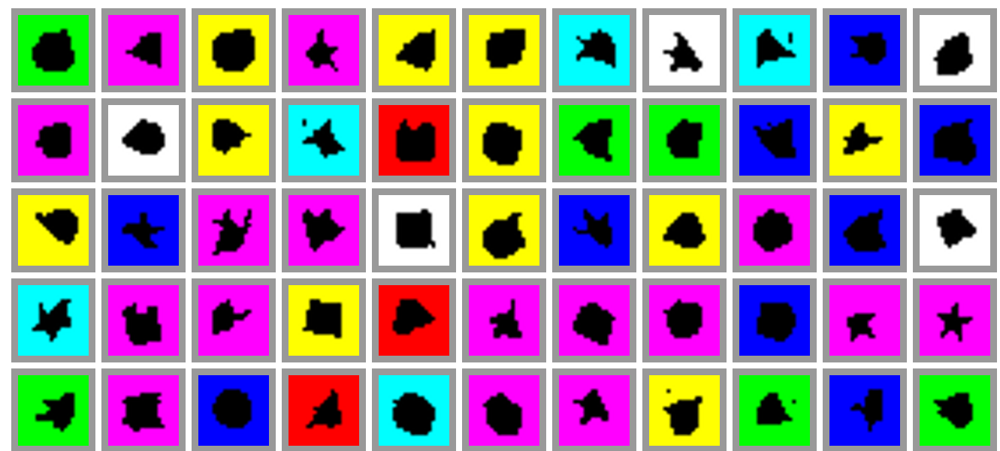
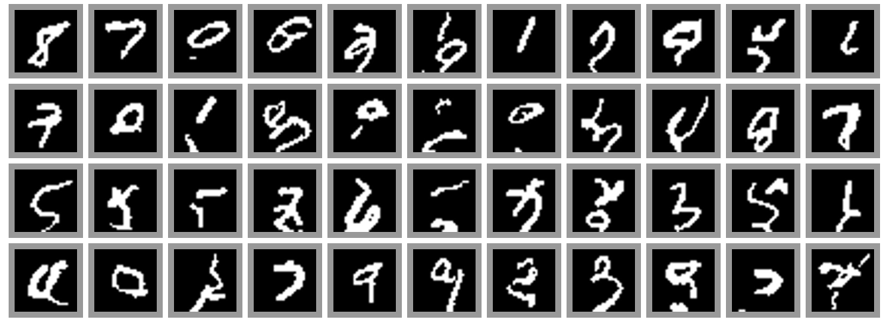
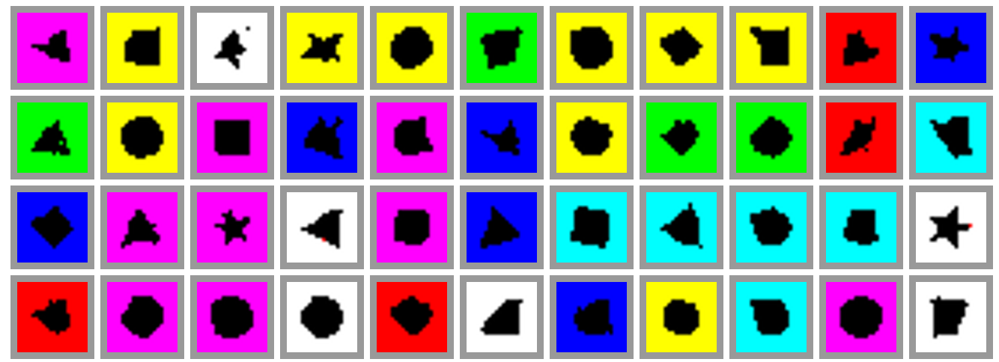
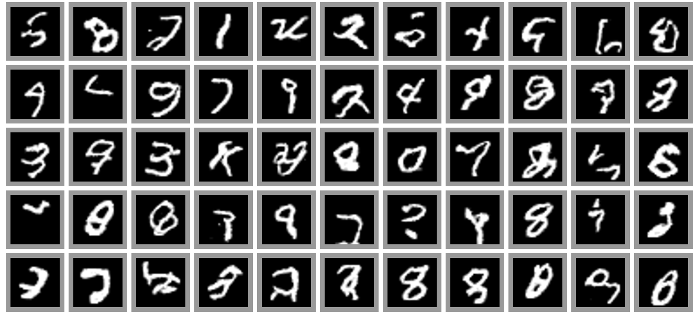
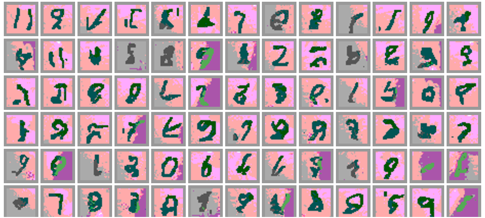

# Autoregressive Model
*Disclaimer:* This is a part of a greater project where we experimented with generative models, you can find the complete project at [repo](https://github.com/MRSAIL-Mini-Robotics-Software-AI-Lab/GANVAS-models)

In this repo, I'll introduce my contribution to the project where I implemented pixelCNN and gatedPixelCNN models using pytorch. For 
pixelCNN I've implemented the following architecture:

And for the gatedPixelCNN, the main difference is replacing the Relu activation function with a gated function, the architecture mainly consists of gated-Blocks that consist of the following components:

## Results:
*PixelCNN samples:*

*GatedPixelCNN samples :*

